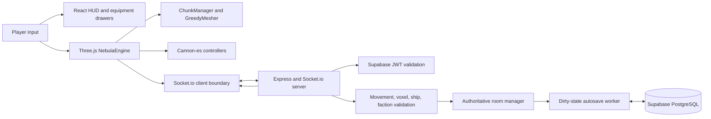

# Nebula Bound Architecture

Nebula Bound uses a separated-client architecture. The browser client owns rendering, immediate input response, local presentation, and user-interface state. The server owns authentication, room membership, authoritative validation, and persistence. The client may predict movement for responsiveness, but it must treat server broadcasts as the canonical multiplayer state once the transport adapter is complete.

## Browser client

The root package hosts a React and Vite application. React owns the access sequence, HUD, loadout/fabrication drawer, market terminal, and faction panel. Three.js runs independently inside `NebulaEngine`, which owns the canvas, renderer, scene, camera, pointer lock, animation loop, lights, star field, and celestial atmosphere shader.

| Client location | Owner | Notes |
| --- | --- | --- |
| `client/src/engine/NebulaEngine.ts` | Scene lifecycle and runtime orchestration | Owns Three.js, Cannon world stepping, camera selection, telemetry emission, and the `?demo` path. |
| `client/src/voxels/` | Voxel data and terrain rendering | Uses a fixed 16×16×16 chunk size and merges exposed faces into reduced geometry. |
| `client/src/physics/PlayerController.ts` | Player motion | Switches between surface movement and altitude-triggered zero-gravity EVA behavior. |
| `client/src/physics/ShipController.ts` | Modular ship motion | Builds ship modules, calculates weighted center of mass, applies thrust/torque, and binds the cockpit camera. |
| `client/src/network/NetworkClient.ts` | Multiplayer connection boundary | Reads `VITE_SOCKET_URL`, reports network state, and is the designated location for authoritative protocol mapping. |
| `client/src/components/` | React presentation | Frames the canvas with operational UI without owning game physics or render state. |

## Voxel and physics model

Terrain is composed of 1×1×1 meter blocks. `ChunkManager` produces deterministic starter terrain buffers and asks `GreedyMesher` to combine compatible exposed faces; the goal is to keep visible chunks compact rather than creating a mesh per block. The initial vessel is assembled from the same block vocabulary—titanium hull, glass, engine, RCS, reactor, fuel, cockpit, and cargo modules.

Cannon-es owns dynamic bodies. `PlayerController` owns a light collider body and uses a camera-aligned semantic input map. `ShipController` owns a rigid body plus a Three.js group: the group carries visible modules while the body receives thrust and yaw torque. The ship recomputes mass and center of mass every time a cargo module is added, then publishes the calculated center as telemetry.

## Authoritative backend

The `nebula-server/` workspace uses Express and Socket.io. Its socket middleware verifies Supabase access tokens before room participation. The room manager limits capacity, validates state changes, emits synchronization events, and marks relevant chunks, ships, and player state as dirty. The autosave service flushes dirty state to Supabase at a configurable interval and preserves a dirty mark when a write fails so it can retry.

| Server location | Owner | Notes |
| --- | --- | --- |
| `src/server.ts` | Process composition | Registers Express routes, Socket.io, lifecycle handlers, and health readiness endpoints. |
| `src/auth/` | Authentication | Validates Supabase-derived identity used by HTTP and Socket.io boundaries. |
| `src/sockets/room-manager.ts` | Room authority | Handles join/leave and broadcasts accepted gameplay state. |
| `src/physics/validation.ts` | Anti-cheat validation | Checks movement velocity and input structure before accepting state. |
| `src/services/autosave.ts` | Persistence cadence | Schedules and flushes dirty entities to the repository layer. |
| `src/database/repository.ts` | Supabase persistence | Performs database read/write operations. |

## Deployment model

The client is suitable for static frontend hosting. The server must run continuously on a Node.js environment that supports long-lived WebSocket connections and the autosave interval. Configure the client with the server’s public HTTPS URL using `VITE_SOCKET_URL`, then set the server’s `CORS_ORIGIN` to the exact public client origin. Store all Supabase keys in server-side secrets; the browser must never receive `SUPABASE_SERVICE_ROLE_KEY`.
