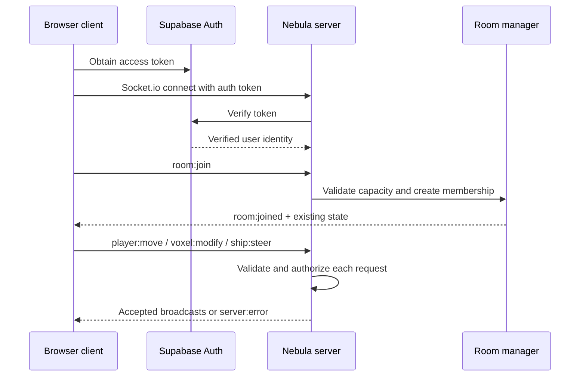

# Client–Server Integration Guide

This document defines the boundary between the current Nebula Bound client and the authoritative `nebula-server` service. It is deliberately explicit because a client that visually appears online must not silently treat unvalidated local data as multiplayer truth.

## Current status

The client already includes a typed Socket.io singleton at `client/src/network/NetworkClient.ts`. It detects `VITE_SOCKET_URL`, exposes `LOCAL`, `CONNECTING`, `SYNCED`, and `OFFLINE` states to the HUD, and can emit a compact local player-state event. The server already authenticates connections and exposes the room, movement, voxel, ship, and faction events described below.

The remaining integration work is an **adapter gap**: the client currently emits `player:state`, whereas the server protocol uses `room:join` and `player:move`. This is intentional rather than hidden. A client is not considered live multiplayer until it implements the authenticated handshake, joins a room, maps local inputs to server events, consumes broadcasts, and reconciles its prediction with authoritative state.

## Required connection sequence



## Authoritative event contract

| Event | Direction | Client responsibility | Server responsibility |
| --- | --- | --- | --- |
| `room:join` | Client → server | Provide a valid room ID, optional username, and initial position after authentication. | Validate token and capacity, establish membership, then return room state. |
| `room:joined` | Server → client | Hydrate remote players, loaded world state, and room metadata. | Send only after successful join. |
| `player:move` | Client → server | Send position, velocity, and rotation at a controlled cadence. | Reject impossible speed or malformed values, then broadcast accepted state. |
| `player:moved` | Server → client | Update remote-player transforms; reconcile local predicted state if needed. | Broadcast accepted movement to room peers. |
| `voxel:modify` | Client → server | Send chunk key, local voxel coordinate, block, and optional faction ID after local interaction. | Rate-limit, validate values and build rights, persist dirty state, and broadcast accepted mutation. |
| `voxel:modified` | Server → client | Rebuild or patch the indicated chunk. | Broadcast only validated accepted edits. |
| `ship:steer` | Client → server | Send vessel intent, not unchecked global physics truth where practical. | Validate control authority and resource bounds, then broadcast accepted vessel state. |
| `ship:steered` | Server → client | Reconcile ship visual/physics state. | Broadcast accepted steering state. |
| `server:error` | Server → client | Display non-destructive feedback and roll back/reconcile optimistic state when needed. | Return a typed event name and human-readable reason. |

## Implementation checklist

1. Add the Supabase browser-auth flow and obtain the active user’s access token before creating the Socket.io connection.
2. Replace the client’s temporary `player:state` emission with a rate-limited `player:move` payload that matches the server schema exactly.
3. Join a selected room with `room:join`, hydrate state from `room:joined`, and maintain a remote-player registry in the Three.js scene.
4. Route block placement/removal through `voxel:modify`; do not make an optimistic client edit durable until the server accepts it.
5. Route cockpit controls through `ship:steer`, retain client-side interpolation for responsiveness, and reconcile on server broadcasts.
6. Display `server:error` as a concise equipment-notice state and restore the authoritative world/ship/inventory state when a request is rejected.
7. Exercise both one-client and two-client test cases, including unauthenticated connection rejection, a full ten-player room, speed-limit rejection, denied faction construction, persistence failure retry, and reconnect behavior.

## Client environment

Create a root `.env` file from `.env.example` during local development.

```bash
VITE_SOCKET_URL=http://localhost:3000
```

The value is public client configuration, not a secret. It must resolve to the public HTTP(S) origin serving Socket.io. The server’s `CORS_ORIGIN` must allow the corresponding client origin.

## Authority rules

The client owns rendering, input capture, local interpolation, and UI feedback. The server owns identity, room membership, accepted movement, world mutations, faction permissions, and persisted state. Resource balances, server timestamps, room capacity, and Supabase service-role credentials are never client authority.
