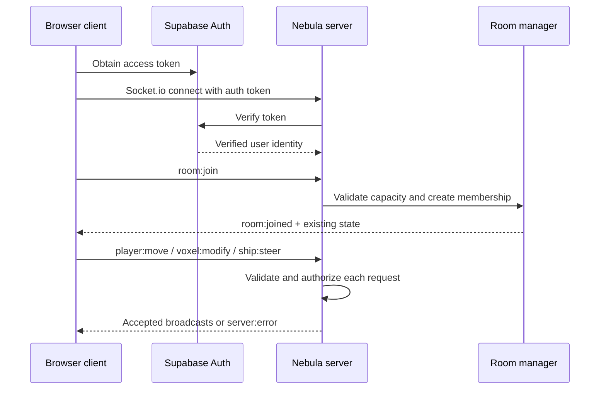

# Client–Server Integration Guide

This document defines the boundary between the current Nebula Bound client and the authoritative `nebula-server` service. It is deliberately explicit because a client that visually appears online must not silently treat unvalidated local data as multiplayer truth.

## Current status

The client includes a typed Socket.io singleton at `client/src/network/NetworkClient.ts`. When both `VITE_SOCKET_URL` and a Supabase access token are supplied, it sends the token through Socket.io `auth.token` and an `Authorization: Bearer` handshake header, then emits `room:join`, `player:move`, `voxel:modify`, and `ship:steer` using the server schemas. It consumes room, player, voxel, ship, and error events; remote players become visible Three.js markers.

When a URL or token is unavailable, the client intentionally reports **MOCK LINK** rather than pretending to be online. `MockNetworkServer` executes the same typed event contract in-browser, while `LocalPersistence` records the local room and crew session in IndexedDB. This permits standalone client work without changing the multiplayer event vocabulary.

## Required connection sequence



## Authoritative event contract

| Event | Direction | Client responsibility | Server responsibility |
| --- | --- | --- | --- |
| `room:join` | Client → server | Provide a valid room ID, optional username, and initial position after authentication. | Validate token and capacity, establish membership, then return room state. |
| `room:joined` | Server → client | Hydrate remote players, loaded world state, and room metadata. | Send only after successful join. |
| `player:move` | Client → server | Send position, velocity, and rotation at a controlled cadence. | Reject impossible speed or malformed values, then broadcast accepted state. |
| `player:moved` | Server → client | Update remote-player transforms; reconcile local predicted state if needed. | Broadcast accepted movement to room peers. |
| `voxel:modify` | Client → server | Send chunk key, local voxel coordinate, block, and optional faction ID after local interaction. | Rate-limit, validate values and build rights, persist dirty state, and broadcast accepted mutation. |
| `voxel:modified` | Server → client | Rebuild or patch the indicated chunk. | Broadcast only validated accepted edits. |
| `ship:steer` | Client → server | Send vessel intent, not unchecked global physics truth where practical. | Validate control authority and resource bounds, then broadcast accepted vessel state. |
| `ship:steered` | Server → client | Reconcile ship visual/physics state. | Broadcast accepted steering state. |
| `server:error` | Server → client | Display non-destructive feedback and roll back/reconcile optimistic state when needed. | Return a typed event name and human-readable reason. |

## Implementation checklist

1. Provide a Supabase browser-auth journey that obtains the active user’s access token and places it in the access terminal before connecting.
2. Select or expose a user-facing room identifier instead of relying on the current field default, then hydrate remote world/chunk state from `room:joined`.
3. Route every future placement/removal interaction through `voxel:modify`; do not make an optimistic client edit durable until the server accepts it.
4. Reconcile local ship transforms, inventory, and block state after accepted or rejected server broadcasts instead of only displaying remote markers.
5. Exercise one-client and two-client test cases, including unauthenticated rejection, a full ten-player room, speed-limit rejection, denied faction construction, persistence retry, and reconnect behavior.

## Client environment

Create a root `.env` file from `.env.example` during local development.

```bash
VITE_SOCKET_URL=http://localhost:3000
```

The value is public client configuration, not a secret. It must resolve to the public HTTP(S) origin serving Socket.io. The server’s `CORS_ORIGIN` must allow the corresponding client origin.

## Authority rules

The client owns rendering, input capture, local interpolation, and UI feedback. The server owns identity, room membership, accepted movement, world mutations, faction permissions, and persisted state. Resource balances, server timestamps, room capacity, and Supabase service-role credentials are never client authority.
